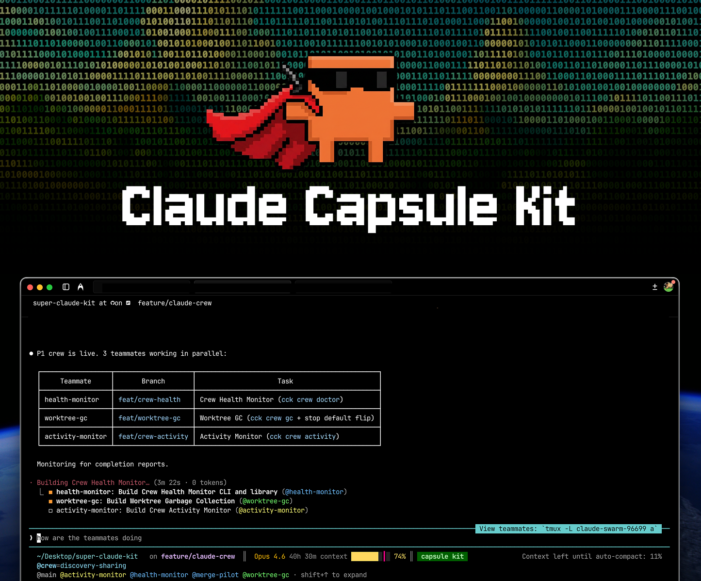
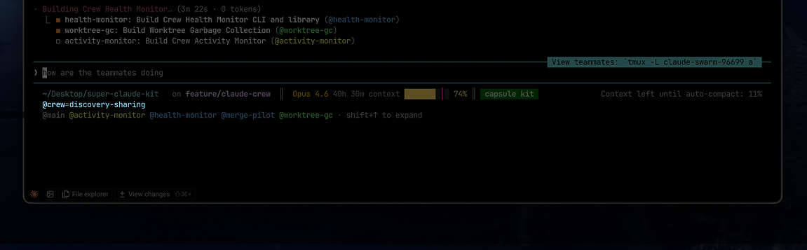

<p align="center">
  
</p>

<p align="center">
  <a href="https://www.npmjs.com/package/claude-capsule-kit"></a>
  <a href="https://opensource.org/licenses/MIT"></a>
  <a href="https://claude.ai"></a>
</p>

<h3 align="center">A toolkit that makes Claude Code better at engineering.</h3>

<p align="center">
  Session memory. Dependency analysis. Large file navigation. 18 specialist agents.<br/>
  Crew teams for parallel multi-branch work. All automatic, zero configuration.
</p>

---

## Install

```bash
npm install -g claude-capsule-kit
cck setup
```

Restart Claude Code. Everything activates automatically via hooks.

---

## Why CCK

Claude Code is powerful out of the box. But on real codebases, you run into limits:

- **Session isolation** — Claude starts fresh every time. Previous context, discoveries, and decisions are lost.
- **No dependency awareness** — Claude doesn't know your import graph. It can't tell you what breaks when you change a file.
- **Large file blindness** — Files over 50KB get truncated. Claude can't navigate framework internals or generated code.
- **Single-threaded work** — One branch, one task at a time. No way to parallelize across features.
- **Agent amnesia** — Sub-agents start with zero context. Findings from one agent don't flow to others.

CCK fills these gaps with a set of tools, hooks, and agents that plug into Claude Code's extension system. Nothing is patched or hacked — it's all built on official hooks, skills, commands, and agent routing.

---

## What's in the kit

### Session Memory

Hooks capture every file read, edit, and agent invocation into a local SQLite database powered by [**blink-query**](https://github.com/arpitnath/blink-query) — a DNS-inspired knowledge resolution layer built for AI agents.

| Event | What happens |
|---|---|
| You read/edit a file | Operation logged to capsule.db |
| Session ends | Summary saved with branch context |
| Next session starts | Previous context restored automatically |
| Context window fills up | Continuity doc saved before compaction |
| You switch branches | Context switches with you |

No manual logging. No `/save` commands. It just works.

```bash
cck stats overview    # See what's been captured
```

### Dependency Tools

Claude Code doesn't know your import graph. CCK builds one.

| Tool | What it answers |
|---|---|
| `query-deps` | What does this file import? Who imports it? |
| `impact-analysis` | What breaks if I change this file? |
| `find-circular` | Are there circular dependencies? |
| `find-dead-code` | What code is never imported? |

These use a pre-built dependency graph (via the Go-based `dependency-scanner`) — instant results instead of Claude scanning files one by one. The Pre-Tool-Use hook automatically suggests the right tool when Claude reaches for a file.

```bash
cck build    # Build Go binaries (dependency-scanner, progressive-reader)
```

### Large File Navigation

Files over 50KB hit Claude Code's token limit. CCK's `progressive-reader` parses the AST and splits files into navigable chunks — functions, classes, sections.

```bash
# Claude uses this automatically when it hits a large file
progressive-reader --path src/huge-file.ts --list     # See structure
progressive-reader --path src/huge-file.ts --chunk 3   # Read specific section
```

Supports TypeScript, JavaScript, Python, and Go. 75-97% token savings on large files.

### 18 Specialist Agents

Fresh-context agents routed by task type. All read-only — they investigate and report, never modify code.

| Agent | What it does |
|---|---|
| `error-detective` | Root cause analysis of errors with structured RCA reports |
| `debugger` | Step-through debugging, stack trace analysis, breakpoint strategies |
| `code-reviewer` | Pre-commit review for bugs, security, performance, code quality |
| `architecture-explorer` | Codebase architecture, service boundaries, integration points |
| `refactoring-specialist` | Safe refactoring plans that preserve existing behavior |
| `security-engineer` | Threat modeling, cryptographic systems, compliance review |
| `database-navigator` | Schema exploration, data models, database relationships |
| `database-architect` | Schema design, query performance, indexing strategies |
| `git-workflow-manager` | Branching strategies, merge conflicts, git best practices |
| `system-architect` | Technical architecture, algorithms, scalability analysis |
| `devops-sre` | Production readiness, monitoring, deployment strategies |
| `brainstorm-coordinator` | Multi-perspective design decisions with parallel specialists |
| `product-dx-specialist` | API design, developer workflows, developer experience |
| `context-librarian` | Context retrieval from capsule records and codebase patterns |
| `context-manager` | Context optimization, conversation summarization, handoff prep |
| `github-issue-tracker` | Create and manage GitHub issues with proper formatting |
| `session-summarizer` | Session summaries for cross-device continuation |
| `agent-developer` | Debug and develop custom agents and MCP integrations |

### Skills

Auto-trigger on keywords. No need to remember commands.

| Skill | Triggers on | What it does |
|---|---|---|
| `/crew` | "team", "parallel", "multi-branch" | Launch and coordinate crew teams |
| `/crew-setup` | manual | Check prerequisites for crew teams |
| `/workflow` | "complex task", "multi-step" | 5-phase systematic task execution |
| `/debug` | "error", "bug", "failing" | RCA-first debugging with specialist agents |
| `/deep-context` | "understand codebase", "need background" | Progressive context building |
| `/code-review` | manual | Pre-commit quality review |
| `/statusline` | manual | Configure statusline sections |

### Crew Teams

Parallel agent teams where each teammate works on their own git branch via worktrees.

<p align="center">
  
</p>

```bash
/crew-setup    # Check readiness
/crew          # Launch and coordinate a team
```

Define teams in `.crew-config.json`:

```json
{
  "team": {
    "name": "my-feature",
    "teammates": [
      { "name": "backend", "branch": "feat/api", "role": "developer", "focus": "Build REST API" },
      { "name": "frontend", "branch": "feat/ui", "role": "developer", "focus": "Build React UI" }
    ]
  },
  "project": { "main_branch": "main" }
}
```

For larger teams, group teammates into **crews**:

```json
{
  "team": {
    "name": "v2-release",
    "crews": [
      {
        "name": "frontend",
        "teammates": [
          { "name": "ui-dev", "branch": "feat/ui", "role": "developer", "focus": "React components" }
        ]
      },
      {
        "name": "backend",
        "teammates": [
          { "name": "api-dev", "branch": "feat/api", "role": "developer", "focus": "REST endpoints" }
        ]
      }
    ]
  }
}
```

Use `--crew <name>` to scope commands to a crew group (e.g. `cck crew merge --crew frontend`).

**Roles**: `developer` (sonnet, auto-commit) | `reviewer` (sonnet, read-only) | `tester` (haiku, auto-commit) | `architect` (opus, read-only)

**What crew teams give you**:
- **Merge preview** — dry-run conflict detection before merging branches back
- **Merge execution** — ordered merge with backup tags and optional test runs
- **Health monitoring** — detect crashed or hung teammates
- **Activity monitor** — real-time file ops per teammate, overlap detection
- **Task decomposition** — dependency-aware splitting for optimal parallelization
- **Discovery sharing** — teammates share findings via shared namespace in capsule.db
- **Session continuity** — handoff docs saved before auto-compact and at session end
- **Worktree GC** — clean up orphaned worktrees from past sessions

---

## How it works

CCK extends Claude Code through its official hook system. Six hooks run at key moments:

```
SessionStart  → Restore previous context, inject discoveries, detect crew membership
PostToolUse   → Capture file ops and agent results to capsule.db
PreToolUse    → Enforce dependency tools, block large file reads, suggest right tool
PreCompact    → Save session continuity doc before context window compacts
SessionEnd    → Save session summary with branch, file count, agent count
Stop          → Quality check after responses
```

All data lives in `~/.claude/capsule.db` — a SQLite database managed by [**blink-query**](https://github.com/arpitnath/blink-query), a resolution engine that organizes knowledge into namespaces with types, tags, and relationships. One global install, automatic project scoping.

---

## CLI

```
cck setup              Install hooks, tools, and context system
cck teardown           Remove CCK (keeps your data)
cck update             Re-install if version changed
cck status             Show what's installed
cck build              Build Go binaries (dependency-scanner, progressive-reader)
cck stats <cmd>        Usage analytics (overview|files|agents|sessions|branch)
cck prune [days]       Clean old records (default: 30 days)

cck crew init          Create .crew-config.json
cck crew start         Launch team (setup worktrees, generate lead prompt)
cck crew stop          Stop team (removes worktrees by default)
cck crew status        Show team state
cck crew doctor        Check teammate health
cck crew activity      Show recent file ops and overlaps
cck crew merge-preview Preview branch merges (conflict detection)
cck crew merge         Execute branch merges
cck crew decompose     Analyze deps and suggest crew config
cck crew discoveries   List shared team discoveries
cck crew gc            Clean up orphaned worktrees
```

---

## Requirements

- **Node.js 18+**
- **Claude Code** with hooks support
- **Git** (for session tracking and crew teams)
- **Go 1.20+** (optional — for dependency scanner and progressive reader, install later with `cck build`)

For crew teams, [enable Agent Teams](https://code.claude.com/docs/en/agent-teams) in Claude Code settings.

---

## Acknowledgements

CCK is built on top of [Anthropic's Claude Code](https://claude.ai/code) extension system — hooks, skills, commands, and sub-agents. None of this would work without their platform.

- [**blink-query**](https://github.com/arpitnath/blink-query) — DNS-inspired knowledge resolution for AI agents. Powers capsule.db storage, namespacing, and resolution.

---

## Uninstall

```bash
cck teardown
npm uninstall -g claude-capsule-kit
```

Your data (`~/.claude/capsule.db`) is preserved.

---

## License

MIT - [Arpit Nath](https://github.com/arpitnath)

<p align="center">
  <a href="https://github.com/arpitnath/claude-capsule-kit/issues">Report Bug</a> ·
  <a href="https://github.com/arpitnath/claude-capsule-kit/issues">Request Feature</a>
</p>
