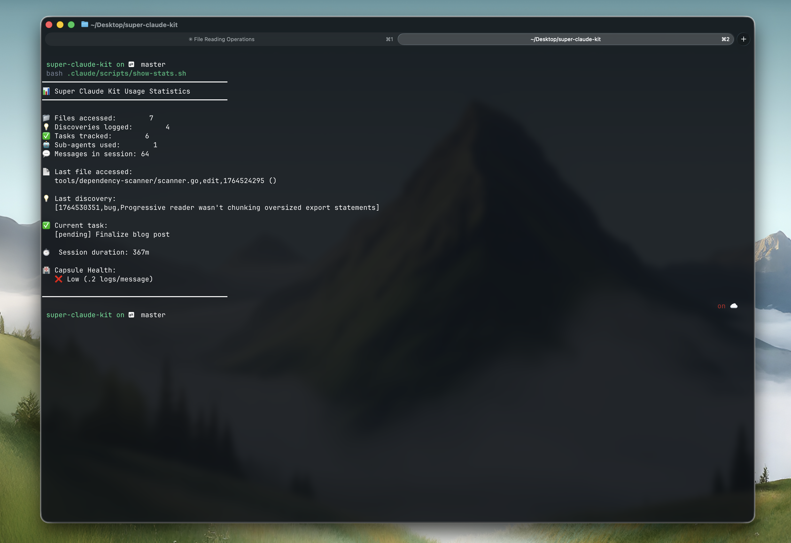

<p align="center">
  
</p>

<p align="center">
  <a href="https://www.npmjs.com/package/claude-capsule-kit"></a>
  <a href="https://opensource.org/licenses/MIT"></a>
  <a href="https://claude.ai"></a>
</p>

<h3 align="center">Context memory and parallel teams for Claude Code.</h3>

<p align="center">
  Automatic session persistence. Branch-aware context. 17 specialist agents.<br/>
  Crew mode for multi-branch parallel work with agent teams.
</p>

---

## Install

```bash
npm install -g claude-capsule-kit
cck setup
```

That's it. Restart Claude Code.

---

## What it does

<!-- TODO: Replace with demo GIF showing session start context injection -->
<p align="center">
  
</p>

**Claude Code loses context between sessions.** You re-explain the same things, it re-reads the same files, it forgets what it learned. CCK fixes this.

- **Auto-captures** every file read, edit, and agent invocation into a local SQLite database
- **Restores context** at session start — branch-aware, so switching branches gives you the right context
- **Surfaces discoveries** — past findings about a file show up when Claude reads it again
- **Crew mode** — spin up parallel agent teams on separate git branches with one command

---

## Features

### Context Memory

Everything is automatic. No manual logging.

| What happens | How |
|---|---|
| You read/edit a file | Captured to capsule.db |
| Session ends | Summary saved with branch name |
| Next session starts | Context injected (branch-aware) |
| Claude reads a file with past discoveries | Discoveries surfaced automatically |

```bash
# See what's been captured
cck stats overview
```

<!-- TODO: Replace with screenshot of stats output -->
<p align="center">
  
</p>

### Crew Mode

Parallel multi-branch agent teams. Each teammate gets their own git worktree.

<!-- TODO: Replace with screenshot/GIF of crew in action -->
<p align="center">
  
</p>

```bash
# Check readiness
/crew-setup

# Launch a team
/crew
```

Define teams in `.crew-config.json`:

```json
{
  "team": {
    "name": "my-team",
    "teammates": [
      { "name": "backend", "branch": "feat/api", "role": "developer", "focus": "Build REST API" },
      { "name": "frontend", "branch": "feat/ui", "role": "developer", "focus": "Build React UI" },
      { "name": "reviewer", "branch": "main", "worktree": false, "role": "reviewer" }
    ]
  },
  "project": { "main_branch": "main" }
}
```

**Roles**: `developer` (sonnet, auto-commit) | `reviewer` (sonnet, read-only) | `tester` (haiku, auto-commit) | `architect` (opus, read-only)

### Skills

Auto-trigger on keywords. No need to remember commands.

| Skill | Triggers on | What it does |
|---|---|---|
| `/crew` | "team", "parallel", "multi-branch" | Launch and coordinate agent teams |
| `/workflow` | "complex task", "multi-step" | 5-phase systematic task execution |
| `/debug` | "error", "bug", "failing" | RCA-first debugging with specialist agents |
| `/deep-context` | "understand codebase", "need background" | Progressive context building |
| `/code-review` | manual | Pre-commit quality review |

### 17 Specialist Agents

Fresh-context agents for deep work. All read-only by default.

| Agent | Use for |
|---|---|
| `error-detective` | Root cause analysis |
| `debugger` | Step-through debugging |
| `code-reviewer` | Code quality review |
| `architecture-explorer` | Codebase architecture |
| `refactoring-specialist` | Safe refactoring plans |
| `security-engineer` | Threat modeling |
| `database-navigator` | Schema exploration |
| `git-workflow-manager` | Git operations |
| `brainstorm-coordinator` | Multi-perspective decisions |

Plus 8 more: `devops-sre`, `system-architect`, `database-architect`, `product-dx-specialist`, `context-manager`, `github-issue-tracker`, `session-summarizer`, `agent-developer`

### Tools

| Tool | What it does |
|---|---|
| `stats` | Usage analytics — top files, agents, session history |
| `context-query` | Search past context, list discoveries, save findings |
| `query-deps` | What imports this file? |
| `impact-analysis` | What breaks if I change this? |
| `find-circular` | Circular dependency detection |
| `find-dead-code` | Unused code identification |
| `progressive-reader` | Navigate large files (>50KB) by AST chunks |

---

## CLI

```
cck setup          Install hooks, tools, and context system
cck teardown       Remove CCK (keeps your data)
cck update         Re-install if version changed
cck status         Show what's installed
cck build          Build Go binaries (dependency-scanner, progressive-reader)
cck stats <cmd>    Usage analytics (overview|files|agents|sessions|branch)
cck crew <cmd>     Manage teams (init|start|stop|status)
cck prune [days]   Clean old records (default: 30 days)
```

---

## Requirements

- **Node.js 18+**
- **Claude Code** with hooks support
- **Git** (for session tracking and crew mode)
- **Go 1.20+** (optional — for dependency scanner and progressive reader, install later with `cck build`)

For crew mode, [enable Agent Teams](https://code.claude.com/docs/en/agent-teams) in Claude Code.

---

## How it works

CCK uses Claude Code hooks to capture and restore context automatically:

```
Session Start → Inject last session context (branch-aware)
File Read     → Log to capsule.db + surface related discoveries
File Edit     → Log to capsule.db
Agent Spawn   → Log invocation and results
Session End   → Save summary with branch, file count, agent count
```

All data lives in `~/.claude/capsule.db`. One global install, works across all projects with automatic project scoping.

---

## Uninstall

```bash
cck teardown
npm uninstall -g claude-capsule-kit
```

Your data (`~/.claude/capsule.db`) is preserved.

---

## License

MIT - [Arpit Nath](https://github.com/arpitnath)

<p align="center">
  <a href="https://github.com/arpitnath/super-claude-kit/issues">Report Bug</a> ·
  <a href="https://github.com/arpitnath/super-claude-kit/issues">Request Feature</a>
</p>
